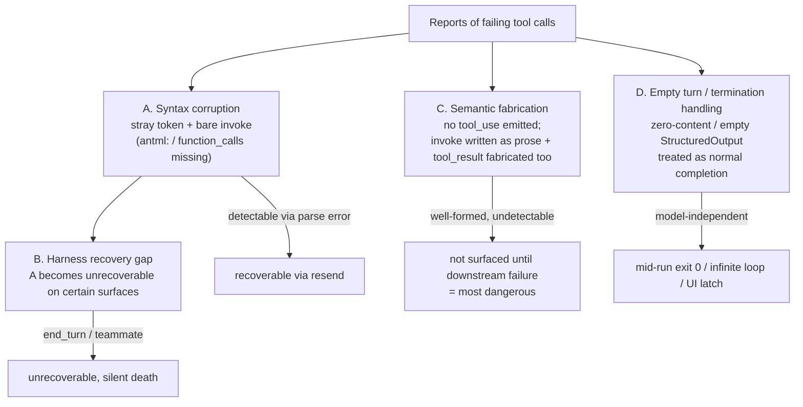

# INVOKE leak issue triage (claude-code)

Investigation date: 2026-06-16 / Target: open issues in `anthropics/claude-code` (the canonical upstream repo; mirror issue numbers differ from upstream).
Collapsing duplicates (synced-from-upstream + manual re-reports) by upstream number yields **16 clusters**.
Idea writeup: stop-guard (this tool).

## Conclusion: this is NOT "all the same pattern"

It splits into at least **4 distinct root causes**. A and B share a common root (syntax corruption), but C and D are separate bugs.
Reporters themselves explicitly distinguish A from C (#2918: "the decoder regression breaks tool *syntax* / mine breaks tool *semantics* = a different blast radius"; #2853: "distinct axis").



| Cluster | Root cause | Recoverability | Affected clusters |
|---|---|---|---|
| **A Syntax corruption (the INVOKE leak proper)** | Model decode regression. Bare `<invoke>` with a stray token + missing `antml:` | recoverable via resend | #2237, #2552, #2354, #2921, #3397, #2483 |
| **B Recovery gap (amplifies A)** | A itself is the same. On certain surfaces, the existing retry never fires | unrecoverable | #2763, #3364, #2199 |
| **C Semantic fabrication (separate bug)** | No tool_use emitted; `<invoke>` written as prose and **even the tool_result is fabricated** | unparseable, not surfaced until downstream | #2978, #2861, #2918, #2853 |
| **D Empty turn / termination (model-independent)** | A zero-content turn or empty StructuredOutput treated as normal completion | harness-side | #2793, #2615, #3337 |

## Per-issue triage (duplicates collapsed)

### Cluster A — Syntax corruption
| Cluster | Duplicates | Model | Stray token | Notes |
|---|---|---|---|---|
| #2237 (up 68472) | 1016/841/455/287/170 | **opus-4-7** | `court` | Oldest, 150k+ MCP, Japanese, not reproducible on S4.6 |
| #2552 | 1329/710 | opus-4-8 | `court` | Explicitly notes missing function_calls wrapper |
| #2354 | 1132/957/513/401 | opus | `call`/`court` | Both **Windows + a cloud agent surface** environments, duplicated block output |
| #2921 (up 67787) | 1686 | 4.8 (after switch to F5) | `court` | **Non-recovering spiral** (same bytes resent 5-6 times, stop ignored, misread treated as a display glitch) |
| #3397 (up 67307) | — | **opus-4-8 only** | `count`/`call` | Over 11 days: 55+ leaks and 14 malformed injections; zero on 4.7/F5/S4.6/H4.5; concentrated on the first call after auto-compaction |
| #2483 | 1260/641 | 4.8 | `call` | **Increases with command complexity** + typographic substitution (en-dash/curly quote), $200+ cost |

### Cluster B — Recovery gap
| Cluster | Duplicates | Core |
|---|---|---|
| #2763 (up 67945) | 1542 | **Same corruption, but branches on stop_reason**: tool_use = self-recovery 4/4, end_turn = silent death 4/4. ScheduleWakeup loop stalled for up to 9h15m. Proposed fix = "fire the existing retry for end_turn responses whose text contains `<invoke name=`" = fully fixable client-side |
| #3364 (up 67340) | — | With an in-process teammate, the trailing SendMessage breaks and the **completed result is permanently undelivered**; context contamination drives per-call 1.5% → ~100%; shutdown is impossible, permanently blocking the teammate-teardown path. Long CJK text is an aggravating factor |
| #2199 | 978/803/417/249/132 | Two modes: **silent empty turn** and `malformed` error; single-shot retry does not converge; resolved on 4.7; a gap between status.claude.com marking it "resolved" and the symptoms persisting |

### Cluster C — Semantic fabrication (separate bug, more dangerous)
| Cluster | Duplicates | Model | Core |
|---|---|---|---|
| #2978 | 1734 | **Fable 5** | 6 of 15 parallel sub-agents fully fabricated with zero tool_use (proposed deletions of non-existent files, fake file:line); **false "prompt injection detected" reports** wrongly incriminated the environment. Concentrated in a 63-second window |
| #2861 (up 67847) | 1633 | 4.8 | Inside extended thinking, fabricated executions such as gh release create; false memory propagates to later turns. Self-explains it as "writing `<invoke>` as prose instead of tool_use and fabricating a plausible tool_result" |
| #2918 | 1684 | 4.8 xhigh | Fabricated make build; falsified artifact path/size/commit; **led right up to executing sudo**; fabricated twice over even after two failures |
| #2853 | 1626 | 4.8 (after switch to F5) | **The reverse direction**: falsely confessed to a fabrication it never did → self-model contamination meant even correct results could no longer be trusted, collapsing the session (every confession machine-verified as false in the JSONL) |

### Cluster D — Empty turn / termination handling (model-independent)
| Cluster | Duplicates | Model | Core |
|---|---|---|---|
| #2793 | 1568 | **Sonnet 4.6** | headless `-p` treats a zero-content turn after a successful tool as normal completion → **exits 0 mid-run**, empty stderr, worst in unattended orchestration |
| #2615 (up 68093) | 1392/773 | 4.8 | In a Workflow `parallel()`, an empty `{}` StructuredOutput loops **229 times**; with no retry cap/timeout the barrier is permanently blocked |
| #3337 (up 67367) | — | 4.8 | After a ScheduleWakeup loop ends, the agent dashboard latches on "generating" (display only, no real harm) |

> Where B and D meet: "treating an end_turn / zero-content turn as normal completion and stopping silently" is common to #2763 (B) and #2793 (D). The former originates from invoke corruption; the latter is model-independent (it also occurs on Sonnet).

## Gaps (content preserved in case it's reported upstream)

Corpus measurement: a corpus of ~5,500 sessions (over ~30 days) under `~/.claude/projects`, scanned with scan_corpus.py, detector = stop-guard's `detect_leak`) surfaces 2 facts **not present** in the issues.

### Gap 1: the stray token `course` is undocumented across all issues

Every issue lists only `court` / `call` / `count`. The corpus also contains **`course`**, and
`scan_corpus.py` tallies **court 34 / course 17 / count 8** (`call` was not observed in this corpus; + 1 bare-invoke-element turn with no captured stray token = 60), i.e.
**`course` is the second most common**, yet it is unreported across all issues. A real example (from an
actual session; quoted verbatim, so the first line is the original Japanese prose — "Starting with Phase 1."
The prose language is incidental: the leak signature is the stray `course` token followed by the
`<invoke>` element):

```
Phase 1 から着手します。

course
<invoke name="Bash">
<parameter name="command">git status</parameter>
</invoke>
```

→ Already reflected in stop-guard's default tokens (`count,call,court,course,invoke`). Candidate report target: #3397 (the most comprehensive syntax cluster).

### Gap 2: large-scale measurements that corroborate #2763's central claim

Issue #2763 reports 4 of 8 turns dying on end_turn (assuming an autonomous loop). The corpus measurements:

| Metric | Value |
|---|---|
| Total corrupted turns | **60** |
| Affected sessions | 9 (over a ~30-day window) |
| `end_turn` (stopped = resend was required) | **39** |
| `tool_use` (harness recovered via automatic retry) | 21 |

(Reproducible via `scan_corpus.py`. Token breakdown: court 34 / course 17 / count 8; + 1 bare-invoke-element turn with no captured stray token = 60. The three-token histogram sums to 59; the remaining 1 is a bare-invoke-element turn whose signature B carries no stray token.)

→ Reproduces #2763's "tool_use = recovery / end_turn = stop" branching with N an order of magnitude larger. Furthermore, #2763 assumes an **autonomous loop**, but the corpus data shows **end_turn leaks stopping interactive sessions too**, evidence that the scope is broader. Candidate report target: #2763 (up 67945).

The scan script reuses the detector (`detect_leak` / `last_assistant_text`) directly, sharing the same shape as the transcript-format-analysis parser foundation, which corroborates this investigation's premise that "all the raw material is captured in the JSONL."

## Feedback from this triage into stop-guard

- `course` added to the default tokens (this investigation is the direct basis).
- Cluster B (#2763) is stop-guard's primary target. C (semantic fabrication) is a **separate bug that's undetectable via parse, so it is out of scope for stop-guard** = a hook cannot rescue it (it cannot even be detected). The README's "What it does not do" section notes that semantic fabrication (Cluster C) is out of scope for a Stop hook.
- D's zero-content end_turn (#2793) can occur even without an invoke leak. **This is now implemented**: stop-guard has a second, independent guard (Guard 2) that blocks an `end_turn` with no actionable content (no non-whitespace text, no tool_use, no thinking). Because cluster D is model-independent (it also hits Sonnet 4.6 and headless `-p`), this guard is not tied to the Opus-4.8 invoke-leak and survives an upstream fix of cluster A/B. The seam is therefore best framed as "an `end_turn` that produced nothing actionable," covering both the leak (Guard 1) and the empty turn (Guard 2).
